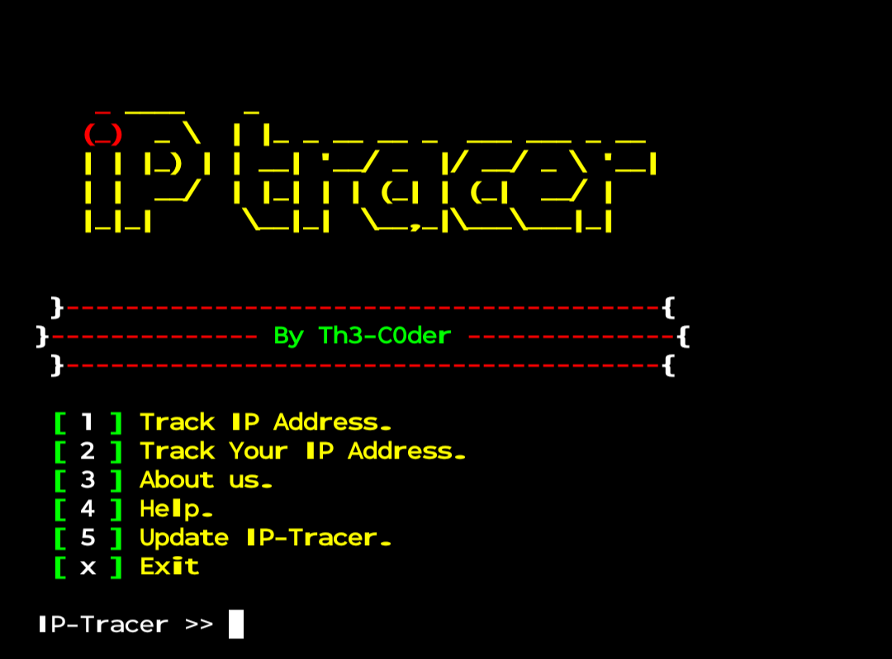
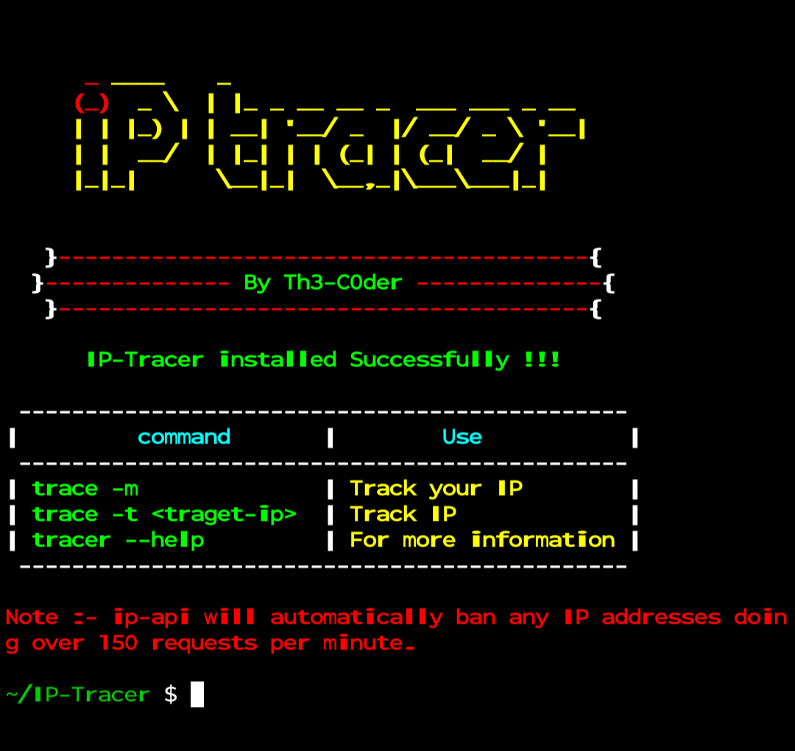

## What is IP-Tracer ?

IP-Tracer is used to track an ip address. IP-Tracer is developed for Termux and Linux based systems. you can easily retrieve ip address information using IP-Tracer. IP-Tracer use ip-api to track ip address.

## How to install IP-Tracer ?

* `apt update`

* `apt install git -y`

* `git clone https://github.com/Th3-C0der/IP-Tracer.git`

* `cd IP-Tracer`

* `chmod +x install`

* `sh install` or `./install`

## How to use IP-Tracer

* `trace -s` to start ip tracer menu.

* `trace -m` to track your own ip address.

* `trace -t target-ip` to track other's ip address for example `ip-tracer -t 127.0.0.1`

* `trace` for more information.

**OR**

* `ip-tracer -s` to start ip tracer menu.

* `ip-tracer -m` to track your own ip address.

* `ip-tracer -t target-ip` to track other's ip address for example `ip-tracer -t 127.0.0.1`

* `ip-tracer` for more information.

## Run IP-Tracer In Google Cloud Shell

  

  

